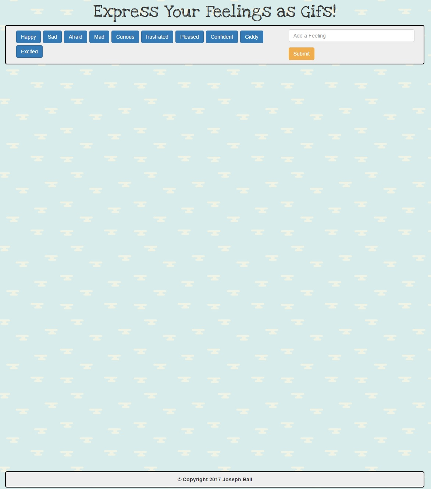
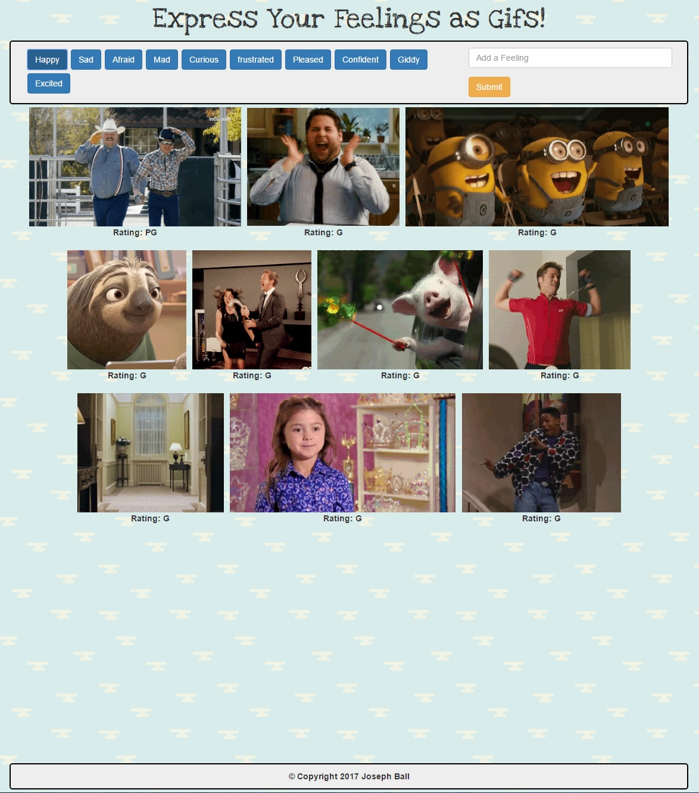
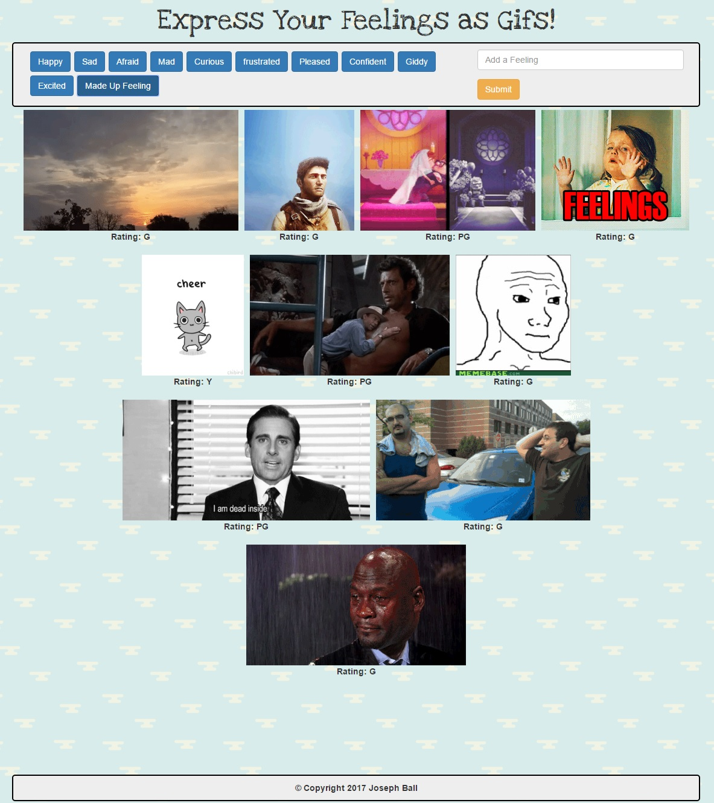

# GifTastic
Displays gifs from the GIPHY API

## Overview
A web page that uses the GIPHY API to display gifs based on which buttons a user clicks.

## On Load Screen

## Functionality
This page is built with `HTML` `CSS` and `JavaScript`. It uses the `GIPHY API`.

## Cloning down the repo
Clone the repo and open `index.html` in your browser.

## Screenshots

### Page with Gifs Generated from On Load Button

### Page with Gifs Generated from User Created Button

## Tech used

    "HTML": "5",
    "CSS": "3",
    "Bootstrap": "3.3.7",
    "JavaScript": "ECMA-262",
    "jQuery": "3.2.1",

## Authors
*Rutgers Codding Bootcamp Project*
* **Joseph Ball** - [josephtball](https://github.com/josephtball)
